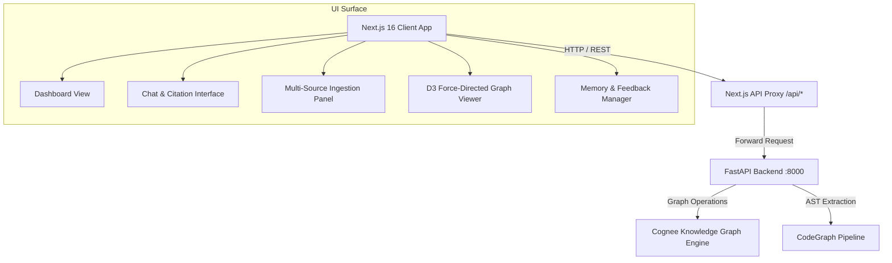

# DevDoc — Frontend Architecture & Design Specification

This document details the frontend architecture, component hierarchy, design token system, and API contract specifications for the **DevDoc** Next.js single-page application.

---

## 1. Architectural Overview

The DevDoc frontend is built with **Next.js 16 (App Router)**, **Tailwind CSS**, **Framer Motion**, and **D3.js**. It communicates with the FastAPI backend via Next.js catch-all proxy routes (`/app/api/[...proxy]/route.ts`) to avoid CORS complexity in browser environments while preserving streaming and REST capabilities.



---

## 2. Design System & Design Tokens

DevDoc utilizes a dark-mode glassmorphic theme engineered for high-density developer interfaces.

### 2.1 Color Palette

| Token | Hex Value | Semantic Purpose |
| :--- | :--- | :--- |
| `background` | `#101415` | Application baseline background |
| `surface` | `#101415` | Base surface layer |
| `primary` | `#4cd7f6` | Primary cyan brand accent & active state |
| `secondary` | `#cebdff` | Secondary violet accent (graph nodes, subtle glow) |
| `tertiary` | `#bcc7de` | Supporting neutral accent |
| `on-surface` | `#e0e3e5` | High-contrast text on dark surfaces |
| `on-surface-variant`| `#bcc9cd` | Medium-contrast secondary text |
| `surface-container` | `#1d2022` | Cards, input containers, and sidebars |
| `surface-container-high` | `#272a2c` | Elevated card panels & active selections |
| `surface-container-lowest` | `#0b0f10` | Code editor background & terminal logs |
| `error` | `#ffb4ab` | Destructive actions & error indicators |

### 2.2 Glassmorphism & Elevation Tokens

```css
/* Core Glassmorphism Panel */
.glass-panel {
  background: rgba(16, 20, 21, 0.65);
  backdrop-filter: blur(40px);
  -webkit-backdrop-filter: blur(40px);
  border: 1px solid rgba(255, 255, 255, 0.1);
}

/* Interactive Card Surface */
.glass-card {
  background: rgba(25, 28, 30, 0.65);
  backdrop-filter: blur(32px);
  -webkit-backdrop-filter: blur(32px);
  border: 1px solid rgba(255, 255, 255, 0.08);
  transition: all 0.3s cubic-bezier(0.4, 0, 0.2, 1);
}

.glass-card:hover {
  border-color: rgba(76, 215, 246, 0.3);
  box-shadow: 0 0 20px rgba(76, 215, 246, 0.15);
}
```

### 2.3 Typography Matrix

| Style Token | Font Family | Size | Weight | Tracking |
| :--- | :--- | :--- | :--- | :--- |
| `display-lg` | JetBrains Mono | 48px / 64px | Bold (700) | `-0.04em` |
| `headline-lg` | JetBrains Mono | 32px | SemiBold (600) | `-0.02em` |
| `headline-md` | JetBrains Mono | 20px | Medium (500) | `normal` |
| `body-lg` | Hanken Grotesk / Inter | 18px | Regular (400) | `normal` |
| `body-md` | Hanken Grotesk / Inter | 16px | Regular (400) | `normal` |
| `code-sm` | JetBrains Mono | 14px | Regular (400) | `normal` |
| `label-caps` | JetBrains Mono | 12px | Bold (700) | `0.1em` |

---

## 3. Component Hierarchy & View Layouts

### 3.1 Global Application Shell

```text
app/layout.tsx                       <html class="dark">, Fonts, ThemeProvider, Ambient Glows
├── app/providers.tsx                next-themes ThemeProvider wrapper
└── app/page.tsx                     Root SPA Orchestrator (Active Tab State & Transitions)
    ├── TopNavBar                    Global breadcrumbs, dataset selector, connection status
    ├── SideNavBar                   Navigation rail with active indicator glows
    ├── <AnimatePresence>            Framer Motion tab transitions
    │   ├── Dashboard                Health metrics, ingestion quick actions, active context
    │   ├── ChatInterface            Source-aware Q&A with syntax-highlighted code blocks
    │   │   └── ChatMessage          Markdown renderer, citation badges, AST node links
    │   ├── IngestionPanel           File upload dropzone, Git clone input, URL ingestion
    │   ├── KnowledgeGraph           D3.js force-directed topology visualizer + Node Inspector
    │   └── MemoryManager            Active dataset inventory, source removal & feedback loop
    ├── CommandPalette               Global Cmd+K search palette
    └── ToastContainer               Telemetry & action notifications
```

### 3.2 View Specifications

#### Dashboard
- **Health Telemetry**: Real-time polling against `GET /health` with latency metrics.
- **Project Scope Switcher**: Dynamic active project context selector.
- **Ingestion Quick-Actions**: Rapid doc ingestion, code mapping, and query triggers.
- **Topological Activity Stream**: Recent graph mutations and ingested entities.

#### Chat Interface
- **Context Citations**: Expandable citation chips mapping assistant assertions directly to source lines and graph nodes.
- **Raw / Augmented Toggle**: Supports switching between raw graph context extraction and synthesized LLM answers.
- **Code Block Actions**: Single-click copy, language badge rendering, and syntax highlighting.

#### Knowledge Graph Visualizer
- **D3 Force Simulation**: Force-directed layout using Coulomb-repulsion and Hooke-attraction mechanics.
- **Node Filtering**: Filter by node category (`File`, `Function`, `Class`, `Document`, `Entity`).
- **Interactive Inspector**: Clicking any node opens a slide-over details panel showing incident edges, caller references, and linked file paths.

#### Ingestion Workflow
- **Multi-Modal Dropper**: Drag-and-drop support for `.pdf`, `.md`, `.txt`, `.json`, etc.
- **Git Repository Connector**: Clones and parses local paths or remote GitHub/GitLab repositories.
- **Streaming Pipeline Telemetry**: Live log output detailing AST extraction and graph node generation.

#### Memory Manager
- **Entity Inventory**: List of all ingested files, websites, and AST modules.
- **Surgical Memory Pruning (`forget`)**: Selectively purge stale sources from the knowledge graph.
- **Context Alignment (`improve`)**: Submit reinforcement feedback to calibrate graph context retrieval.

---

## 4. API Proxy Contract

All endpoints are hosted on `http://localhost:8000` and proxied through Next.js at `/api/*`:

| Endpoint | Method | Payload / Form Data | Description |
| :--- | :--- | :--- | :--- |
| `/health` | `GET` | — | Backend health check & version info |
| `/api/chat` | `POST` | `{ project, question, onlyContext?, sessionId? }` | Queries knowledge graph with citations |
| `/api/ingest/docs` | `POST` | `FormData(project, urls, files)` | Ingests PDFs, markdown, and web URLs |
| `/api/ingest/code` | `POST` | `{ project, repoPath, cloneUrl?, sessionId? }` | Parses repository via AST pipeline |
| `/api/memory/forget`| `POST` | `{ project, source, sessionId? }` | Removes specific source from graph |
| `/api/memory/improve`| `POST`| `{ project, feedback?, sessionIds }` | Refines graph memory based on feedback |
| `/api/graph/data` | `POST` | `{ project }` | Returns node/edge graph payload for D3 |
| `/api/graph/metrics` | `POST`| `{ project }` | Returns node, edge, and density statistics |
